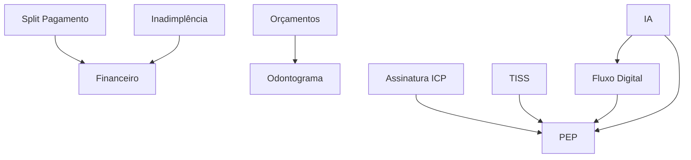

# Arquitetura do Sistema Ortho+

## 📐 Visão Geral da Arquitetura

O Ortho+ foi projetado seguindo princípios de **Clean Architecture**, **Domain-Driven Design** e **Modular Architecture** para garantir escalabilidade, manutenibilidade e testabilidade.

### Desenvolvido por TSI Telecom
**Copyright © 2025 TSI Telecom**

---

## 🎯 Princípios Arquiteturais

### 1. Modularidade Descentralizada
Cada módulo é uma unidade independente com sua própria lógica de negócio, componentes, hooks e tipos.

```
src/modules/[module-name]/
├── components/      # Componentes React específicos
├── hooks/          # Custom hooks (state management)
├── types/          # TypeScript types e Zod schemas
└── utils/          # Utilitários específicos do módulo
```

### 2. Separação de Responsabilidades

**Frontend (React)**
- Apresentação (UI Components)
- Gerenciamento de estado local (useState, useReducer)
- Validação client-side (Zod schemas)
- Navegação e roteamento

**Backend (Supabase)**
- Autenticação e autorização (JWT + RLS)
- Persistência de dados (PostgreSQL)
- Lógica de negócio complexa (Edge Functions)
- Validação server-side

**Database (PostgreSQL)**
- Armazenamento de dados estruturados
- Integridade referencial (Foreign Keys)
- Segurança (Row Level Security)
- Auditoria (Triggers e Functions)

### 3. Segurança em Camadas

```
┌─────────────────────────────────────┐
│   1. Frontend Validation (Zod)     │
├─────────────────────────────────────┤
│   2. Edge Functions Validation     │
├─────────────────────────────────────┤
│   3. RLS Policies (PostgreSQL)     │
├─────────────────────────────────────┤
│   4. Database Constraints          │
└─────────────────────────────────────┘
```

---

## 🏗️ Arquitetura de Módulos

### Grafo de Dependências



### Gerenciamento de Dependências

**Edge Function: toggle-module-state**
```typescript
// Lógica Praxeológica de Ativação
if (tentandoAtivar) {
  // Verificar dependências não atendidas
  if (dependenciasNaoAtendidas.length > 0) {
    return 412 // Precondition Failed
  }
}

if (tentandoDesativar) {
  // Verificar dependentes ativos
  if (dependentesAtivos.length > 0) {
    return 412 // Precondition Failed
  }
}
```

---

## 🔄 Fluxo de Dados

### 1. Leitura (Query)

```
User Action
    ↓
React Component
    ↓
Custom Hook (useXxxSupabase)
    ↓
Supabase Client Query
    ↓
RLS Policy Check ✓
    ↓
PostgreSQL Query
    ↓
Return Data
    ↓
React Query Cache
    ↓
Component Update (setState)
    ↓
UI Render
```

### 2. Escrita (Mutation)

```
User Action
    ↓
Form Validation (Zod) ✓
    ↓
Custom Hook (useXxxSupabase)
    ↓
Edge Function Call
    ↓
Server-side Validation ✓
    ↓
RLS Policy Check ✓
    ↓
Database Trigger (Audit)
    ↓
PostgreSQL Write
    ↓
Return Success
    ↓
React Query Invalidation
    ↓
Refetch + UI Update
```

---

## 🗄️ Arquitetura de Dados

### Schema Principal

```sql
-- Multi-tenancy
clinics
├── id (UUID PK)
├── name
└── backup_config

-- Usuários e Roles
profiles
├── id (UUID PK, FK auth.users)
├── clinic_id (FK clinics)
└── full_name

user_roles
├── user_id (FK profiles)
├── clinic_id (FK clinics)
└── role (ADMIN | MEMBER)

-- Sistema de Módulos
module_catalog
├── id (SERIAL PK)
├── module_key (UNIQUE)
├── name
├── description
└── category

clinic_modules
├── id (SERIAL PK)
├── clinic_id (FK clinics)
├── module_catalog_id (FK module_catalog)
└── is_active (BOOLEAN)

module_dependencies
├── module_id (FK module_catalog)
└── depends_on_module_id (FK module_catalog)

-- Auditoria
audit_logs
├── id (BIGSERIAL PK)
├── user_id (FK auth.users)
├── clinic_id (FK clinics)
├── action
├── target_module_id
└── details (JSONB)
```

### Row Level Security (RLS)

**Padrão de Políticas**
```sql
-- SELECT: Usuário vê apenas dados de sua clínica
CREATE POLICY "select_own_clinic"
ON table_name FOR SELECT
USING (clinic_id = auth.jwt() ->> 'clinic_id');

-- INSERT: Usuário insere apenas em sua clínica
CREATE POLICY "insert_own_clinic"
ON table_name FOR INSERT
WITH CHECK (clinic_id = auth.jwt() ->> 'clinic_id');

-- UPDATE: Usuário atualiza apenas sua clínica
CREATE POLICY "update_own_clinic"
ON table_name FOR UPDATE
USING (clinic_id = auth.jwt() ->> 'clinic_id');

-- DELETE: Apenas ADMIN pode deletar
CREATE POLICY "delete_admin_only"
ON table_name FOR DELETE
USING (
  EXISTS (
    SELECT 1 FROM user_roles
    WHERE user_id = auth.uid()
    AND role = 'ADMIN'
  )
);
```

---

## 🔌 Edge Functions Architecture

### Estrutura Padrão

```typescript
import { createClient } from '@supabase/supabase-js'
import { corsHeaders } from '../_shared/cors.ts'

Deno.serve(async (req) => {
  // 1. CORS preflight
  if (req.method === 'OPTIONS') {
    return new Response(null, { headers: corsHeaders })
  }

  try {
    // 2. Inicializar cliente Supabase
    const supabase = createClient(
      Deno.env.get('SUPABASE_URL'),
      Deno.env.get('SUPABASE_ANON_KEY'),
      { global: { headers: { Authorization: req.headers.get('Authorization') } } }
    )

    // 3. Autenticação
    const { data: { user }, error: authError } = await supabase.auth.getUser()
    if (authError || !user) {
      return new Response(JSON.stringify({ error: 'Unauthorized' }), { status: 401 })
    }

    // 4. Autorização (se necessário)
    const { data: roles } = await supabase
      .from('user_roles')
      .select('role')
      .eq('user_id', user.id)
    
    if (!roles?.some(r => r.role === 'ADMIN')) {
      return new Response(JSON.stringify({ error: 'Forbidden' }), { status: 403 })
    }

    // 5. Buscar clinic_id
    const { data: profile } = await supabase
      .from('profiles')
      .select('clinic_id')
      .eq('id', user.id)
      .single()

    // 6. Validação de input
    const body = await req.json()
    // ... validar com Zod ou manualmente

    // 7. Lógica de negócio
    // ... executar operações

    // 8. Auditoria
    await supabase.from('audit_logs').insert({
      user_id: user.id,
      clinic_id: profile.clinic_id,
      action: 'ACTION_NAME',
      details: { ... }
    })

    // 9. Retorno
    return new Response(JSON.stringify({ success: true }), { 
      status: 200,
      headers: corsHeaders 
    })

  } catch (error) {
    return new Response(JSON.stringify({ error: error.message }), { 
      status: 500,
      headers: corsHeaders 
    })
  }
})
```

### Principais Edge Functions

| Function | Propósito | Frequência |
|----------|-----------|------------|
| `get-my-modules` | Busca módulos ativos | On-demand |
| `toggle-module-state` | Ativa/desativa módulos | On-demand |
| `processar-pagamento` | Processa pagamentos PIX/cartão | On-demand |
| `processar-split-pagamento` | Divide pagamento entre dentistas | On-demand |
| `enviar-cobranca` | Envia cobranças automáticas | Scheduled |
| `gerar-pedidos-automaticos` | Cria pedidos de reposição | Scheduled |
| `prever-reposicao` | ML para previsão de estoque | On-demand |
| `analisar-radiografia` | IA para análise de raio-X | On-demand |
| `send-stock-alerts` | Alertas de estoque baixo | Scheduled |

---

## 🎨 Frontend Architecture

### Component Hierarchy

```
App (Router)
├── AuthProvider
│   ├── ModulesProvider
│   │   ├── ThemeProvider
│   │   │   └── Layout
│   │   │       ├── AppSidebar (Navigation)
│   │   │       ├── DashboardHeader
│   │   │       └── Main Content
│   │   │           ├── ProtectedRoute
│   │   │           │   └── Page Component
│   │   │           │       ├── Module Components
│   │   │           │       │   ├── Forms
│   │   │           │       │   ├── Lists
│   │   │           │       │   └── Details
│   │   │           │       └── Shared Components
│   │   │           └── Toaster (Notifications)
```

### State Management Strategy

```typescript
// 1. Local State (useState)
// Para estado simples de componente
const [isOpen, setIsOpen] = useState(false)

// 2. Custom Hooks (Supabase Persistence)
// Para estado persistente por módulo
const { pacientes, loading, createPaciente } = usePatientsStore()

// 3. Context API (Global State)
// Para estado compartilhado entre componentes
const { user, clinicId, isAdmin } = useAuth()
const { activeModules } = useModules()
const { theme, setTheme } = useTheme()

// 4. React Query (Server State)
// Para cache e sincronização com servidor
const { data, isLoading } = useQuery({
  queryKey: ['pacientes', clinicId],
  queryFn: fetchPacientes
})
```

### Routing Structure

```typescript
<Routes>
  {/* Public Routes */}
  <Route path="/auth" element={<Auth />} />

  {/* Protected Routes */}
  <Route element={<ProtectedRoute />}>
    <Route path="/" element={<Dashboard />} />
    
    {/* Module Routes */}
    <Route path="/pacientes" element={<Pacientes />} />
    <Route path="/pep" element={<PEP />} />
    <Route path="/financeiro" element={<Financeiro />} />
    <Route path="/financeiro/contas-receber" element={<ContasReceber />} />
    <Route path="/estoque" element={<EstoqueDashboard />} />
    
    {/* Settings (Admin Only) */}
    <Route path="/configuracoes" element={<Configuracoes />} />
  </Route>

  {/* 404 */}
  <Route path="*" element={<NotFound />} />
</Routes>
```

---

## 🔐 Security Architecture

### Authentication Flow

```
1. User enters credentials
    ↓
2. Supabase Auth validates
    ↓
3. JWT token generated with custom claims
    {
      sub: user_id,
      email: user_email,
      clinic_id: clinic_uuid,
      app_role: 'ADMIN' | 'MEMBER'
    }
    ↓
4. Token stored in localStorage
    ↓
5. Token sent in Authorization header
    ↓
6. RLS policies validate clinic_id
    ↓
7. Access granted/denied
```

### Authorization Levels

```typescript
// 1. Route Level (ProtectedRoute)
<ProtectedRoute requiredRole="ADMIN">
  <AdminPage />
</ProtectedRoute>

// 2. Component Level (useAuth hook)
const { isAdmin } = useAuth()
{isAdmin && <AdminButton />}

// 3. API Level (Edge Functions)
if (!roles?.some(r => r.role === 'ADMIN')) {
  return 403 // Forbidden
}

// 4. Database Level (RLS Policies)
CREATE POLICY "admin_only"
ON table_name
FOR ALL
USING (has_role(auth.uid(), 'ADMIN'))
```

---

## 📊 Performance Optimization

### Code Splitting

```typescript
// Lazy loading de páginas
const Pacientes = lazy(() => import('./pages/Pacientes'))
const PEP = lazy(() => import('./pages/PEP'))
const Financeiro = lazy(() => import('./pages/Financeiro'))

// Com Suspense
<Suspense fallback={<LoadingSpinner />}>
  <Routes>
    <Route path="/pacientes" element={<Pacientes />} />
  </Routes>
</Suspense>
```

### Database Optimization

```sql
-- Índices para queries frequentes
CREATE INDEX idx_clinic_modules_clinic ON clinic_modules(clinic_id);
CREATE INDEX idx_audit_logs_clinic_date ON audit_logs(clinic_id, created_at DESC);
CREATE INDEX idx_pacientes_clinic_cpf ON pacientes(clinic_id, cpf);

-- Índices compostos
CREATE INDEX idx_transactions_clinic_status ON transacoes_pagamento(clinic_id, status, created_at);
```

### Caching Strategy

```typescript
// React Query com stale-while-revalidate
const { data } = useQuery({
  queryKey: ['pacientes', clinicId],
  queryFn: fetchPacientes,
  staleTime: 5 * 60 * 1000, // 5 minutos
  cacheTime: 10 * 60 * 1000, // 10 minutos
  refetchOnWindowFocus: false
})
```

---

## 🧪 Testing Strategy

### Testing Pyramid

```
           E2E Tests
         (Playwright)
    ────────────────────
      Integration Tests
        (Vitest + RTL)
   ─────────────────────────
        Unit Tests
     (Vitest + Zod)
  ────────────────────────────────
```

### Coverage Goals

- **Unit Tests**: > 80%
- **Integration Tests**: > 60%
- **E2E Tests**: Critical paths (> 90%)

---

## 📈 Scalability Considerations

### Horizontal Scaling

- **Supabase**: Auto-scaling até 500k MAU
- **Edge Functions**: Deno Deploy escala automaticamente
- **PostgreSQL**: Connection pooling via PgBouncer

### Vertical Scaling

- **Database**: Upgrade de instância via dashboard
- **Storage**: S3-compatible (ilimitado)
- **Compute**: Funções serverless (auto-scale)

### Multi-region

- **CDN**: Cloudflare para assets estáticos
- **Database**: Read replicas em múltiplas regiões
- **Functions**: Deploy em edge locations

---

## 🔄 CI/CD Pipeline

```yaml
# .github/workflows/deploy.yml
name: Deploy to Production

on:
  push:
    branches: [main]

jobs:
  test:
    - Run unit tests
    - Run integration tests
    - Run E2E tests
    
  build:
    - Build frontend (Vite)
    - Optimize assets
    - Generate sourcemaps
    
  deploy:
    - Deploy Edge Functions
    - Run migrations
    - Deploy frontend (Vercel/Netlify)
    - Invalidate CDN cache
    
  monitor:
    - Health check
    - Performance metrics
    - Error tracking (Sentry)
```

---

## 📚 Referências Técnicas

### Padrões Utilizados

- **Clean Architecture** (Uncle Bob)
- **Domain-Driven Design** (Eric Evans)
- **SOLID Principles**
- **Praxeology** (Ludwig von Mises) - para lógica de módulos
- **Graph-RAG** - para grafo de dependências

### Frameworks e Bibliotecas

- React 18 (Concurrent Features)
- TypeScript 5 (Latest)
- Tailwind CSS 3 (JIT)
- Supabase (BaaS)
- Zod (Schema Validation)
- React Query (Server State)

---

*Documentação Técnica | TSI Telecom © 2025*
