# 🏗️ Documentação Técnica - Implementação de Crypto Payments

## 📋 Índice

1. [Visão Geral da Arquitetura](#visão-geral-da-arquitetura)
2. [Fluxos de Pagamento](#fluxos-de-pagamento)
3. [Componentes do Sistema](#componentes-do-sistema)
4. [Segurança e Criptografia](#segurança-e-criptografia)
5. [Integração com Blockchain](#integração-com-blockchain)
6. [Event-Driven Architecture](#event-driven-architecture)
7. [Testes](#testes)
8. [Deployment](#deployment)
9. [Troubleshooting](#troubleshooting)

---

## 🎯 Visão Geral da Arquitetura

### Stack Tecnológica

```
Frontend:
├── React 18 + TypeScript
├── Tailwind CSS + shadcn/ui
├── React Query (TanStack Query)
└── qrcode library

Backend:
├── Supabase (PostgreSQL + RLS)
├── Edge Functions (Deno)
└── Real-time subscriptions

External APIs:
├── Binance API
├── Coinbase API
├── Kraken API
├── Mercado Bitcoin API
├── Blockstream API (Bitcoin)
└── BTCPay Server (self-hosted)
```

### Arquitetura em Camadas

```
┌─────────────────────────────────────────────────────────────┐
│                         UI Layer                             │
│  (Components: CryptoPaymentPDV, PaymentDialog, etc)         │
└─────────────────────────────────────────────────────────────┘
                              ↓
┌─────────────────────────────────────────────────────────────┐
│                    Application Layer                         │
│  (Use Cases: GeneratePaymentAddress, ProcessWebhook, etc)   │
└─────────────────────────────────────────────────────────────┘
                              ↓
┌─────────────────────────────────────────────────────────────┐
│                      Domain Layer                            │
│     (Entities: CryptoTransaction, Events, Value Objects)    │
└─────────────────────────────────────────────────────────────┘
                              ↓
┌─────────────────────────────────────────────────────────────┐
│                  Infrastructure Layer                        │
│   (Adapters: ExchangeFactory, BlockchainMonitor, Supabase)  │
└─────────────────────────────────────────────────────────────┘
```

---

## 🔄 Fluxos de Pagamento

### Fluxo 1: Exchange API (Custodial)


---

### Fluxo 2: Wallet Offline (Non-Custodial - xPub)


---

### Fluxo 3: BTCPay Server (Non-Custodial - Self-Hosted)

```mermaid
sequenceDiagram
    participant User as Usuário
    participant Frontend as Frontend
    participant UseCase as CreateCryptoInvoiceUseCase
    participant Adapter as BTCPayAdapter
    participant BTCPay as BTCPay Server
    participant DB as Supabase DB
    participant Webhook as process-crypto-webhook (Edge Function)

    User->>Frontend: Seleciona "Pagar com Crypto"
    Frontend->>UseCase: execute({ clinicId, amount: 1000, currency: 'BRL' })
    UseCase->>Adapter: createInvoice({ amount, orderId })
    Adapter->>BTCPay: POST /api/v1/stores/{storeId}/invoices
    BTCPay-->>Adapter: { invoiceId, checkoutLink, paymentCodes: { BTC: { BIP21: '...' } } }
    Adapter-->>UseCase: BTCPayInvoice
    UseCase->>DB: INSERT crypto_transactions (invoice_id, status: 'PENDING')
    UseCase-->>Frontend: { invoiceId, checkoutLink, qrCodeData }
    Frontend->>User: Exibe QR Code OU redireciona para checkoutLink

    Note over BTCPay: Usuário paga via Bitcoin/Lightning
    BTCPay->>Webhook: POST /process-crypto-webhook (HMAC signature)
    Webhook->>Webhook: validateSignature(payload, signature, secret)
    Webhook->>DB: UPDATE crypto_transactions (status: 'PROCESSING')
    
    BTCPay->>Webhook: POST /process-crypto-webhook (InvoiceSettled)
    Webhook->>DB: UPDATE crypto_transactions (status: 'CONFIRMED', tx_hash)
    Webhook->>EventBus: Publish(CryptoPaymentConfirmedEvent)
    EventBus->>Handler: handle(event)
    Handler->>User: Toast: "Pagamento confirmado!"
```



---

## 🧩 Componentes do Sistema

### 1. Frontend Components

#### `CryptoPaymentSelector.tsx`
```typescript
/**
 * Componente reutilizável para seleção de método de pagamento crypto.
 * Usado em: PaymentDialog, PDV, Orçamentos
 */
interface CryptoPaymentSelectorProps {
  amount: number; // Valor em BRL
  onPaymentConfirmed: (txHash: string, cryptocurrency: string) => void;
  onCancel?: () => void;
}
```

**Responsabilidades:**
- Listar wallets/exchanges disponíveis
- Selecionar criptomoeda (BTC, ETH, USDT, BNB)
- Gerar endereço de pagamento (via Use Case)
- Exibir QR Code
- Monitorar status do pagamento

---

#### `CryptoPaymentPDV.tsx`
```typescript
/**
 * Componente específico para PDV (integra com IntegracaoTEF.tsx)
 */
export default function CryptoPaymentPDV({ 
  vendaId, 
  valorTotal, 
  onSuccess 
}: CryptoPaymentPDVProps)
```

**Características:**
- Interface otimizada para caixa (telas grandes)
- Polling automático de confirmação
- Integração com `pdv_vendas` e `pdv_pagamentos`

---

#### `XPubConfigForm.tsx`
```typescript
/**
 * Formulário para configurar wallets offline (xPub)
 */
export function XPubConfigForm({ clinicId, onSave }: Props)
```

**Validações:**
- Formato da xPub (xpub, ypub, zpub)
- Derivation path (BIP44/49/84)
- Teste de derivação (gera endereço #0)

---

### 2. Use Cases (Application Layer)

#### `GeneratePaymentAddressUseCase.ts`
```typescript
/**
 * Gera endereço de pagamento (exchange ou offline wallet)
 */
export class GeneratePaymentAddressUseCase {
  async execute(dto: GeneratePaymentAddressDTO): Promise<PaymentAddressResult>
}
```

**Fluxo:**
1. Busca config da wallet (exchange ou offline)
2. Gera/deriva endereço:
   - Exchange: usa endereço fixo ou chama API
   - Offline: deriva do xPub (incrementa índice)
3. Cria transação no DB (status: PENDING)
4. Retorna `{ address, qrCodeData, transactionId }`

---

#### `CreateCryptoInvoiceUseCase.ts`
```typescript
/**
 * Cria invoice no BTCPay Server
 */
export class CreateCryptoInvoiceUseCase {
  async execute(dto: CreateCryptoInvoiceDTO): Promise<CryptoTransaction>
}
```

**Integração com BTCPay:**
- Usa `BTCPayAdapter` para criar invoice
- Salva `invoice_id` no DB
- Retorna `checkoutLink` (UI completa do BTCPay)

---

#### `ProcessWebhookUseCase.ts`
```typescript
/**
 * Processa webhooks de exchanges/BTCPay
 */
export class ProcessWebhookUseCase {
  async execute(dto: ProcessWebhookDTO): Promise<void>
}
```

**Eventos suportados:**
- `InvoiceCreated`
- `InvoiceReceivedPayment`
- `InvoiceProcessing` (aguardando confirmações)
- `InvoiceSettled` (confirmado)
- `InvoiceExpired`

---

### 3. Infrastructure Layer

#### `ExchangeFactory.ts`
```typescript
/**
 * Factory Pattern para criar adapters de exchanges
 */
export class ExchangeFactory {
  static create(
    exchangeName: 'BINANCE' | 'COINBASE' | 'KRAKEN' | 'MERCADO_BITCOIN',
    apiKey: string,
    apiSecret: string
  ): ICryptoExchange
}
```

**Interface `ICryptoExchange`:**
```typescript
export interface ICryptoExchange {
  getWalletBalance(coin: string): Promise<number>;
  generateDepositAddress(coin: string): Promise<string>;
  getExchangeRate(from: string, to: string): Promise<number>;
  validateCredentials(): Promise<boolean>;
}
```

---

#### `BlockchainMonitor.ts`
```typescript
/**
 * Monitora endereços na blockchain (polling)
 */
export class BlockchainMonitor {
  async watchAddress(config: MonitorConfig): Promise<void>
  stopWatching(address: string): void
}
```

**APIs utilizadas:**
- **Bitcoin**: Blockstream API (`https://blockstream.info/api`)
- **Ethereum**: Etherscan API ou Infura (requer API key)
- **USDT**: Etherscan (ERC20) ou TronScan (TRC20)

**Polling:**
- Intervalo: 30 segundos
- Timeout: 2 horas
- Confirmações mínimas: 1 (configurável)

---

### 4. Database Schema

#### Tabela: `crypto_exchange_config`
```sql
CREATE TABLE public.crypto_exchange_config (
  id UUID PRIMARY KEY DEFAULT gen_random_uuid(),
  clinic_id UUID REFERENCES public.clinics(id) NOT NULL,
  exchange_name TEXT NOT NULL, -- BINANCE, COINBASE, KRAKEN, MERCADO_BITCOIN
  api_key_encrypted TEXT NOT NULL, -- Encrypted with pgcrypto
  api_secret_encrypted TEXT, -- Encrypted
  wallet_address TEXT, -- Endereço fixo de depósito (se aplicável)
  webhook_secret TEXT, -- Para validar webhooks
  supported_coins JSONB DEFAULT '["BTC", "ETH", "USDT"]'::jsonb,
  auto_convert_to_brl BOOLEAN DEFAULT false,
  is_active BOOLEAN DEFAULT true,
  created_at TIMESTAMPTZ DEFAULT now(),
  updated_at TIMESTAMPTZ DEFAULT now()
);
```

#### Tabela: `crypto_offline_wallets`
```sql
CREATE TABLE public.crypto_offline_wallets (
  id UUID PRIMARY KEY DEFAULT gen_random_uuid(),
  clinic_id UUID REFERENCES public.clinics(id) NOT NULL,
  wallet_name TEXT NOT NULL,
  hardware_type TEXT CHECK (hardware_type IN ('trezor', 'coldcard', 'krux', 'ledger', 'other')),
  xpub TEXT NOT NULL, -- Encrypted in production
  derivation_path TEXT DEFAULT 'm/84''/0''/0''/0', -- BIP84 (SegWit Native)
  address_type TEXT DEFAULT 'p2wpkh' CHECK (address_type IN ('p2pkh', 'p2sh', 'p2wpkh')),
  last_used_index INTEGER DEFAULT 0,
  gap_limit INTEGER DEFAULT 20,
  supported_coins JSONB DEFAULT '["BTC"]'::jsonb,
  is_active BOOLEAN DEFAULT true,
  is_verified BOOLEAN DEFAULT false,
  created_at TIMESTAMPTZ DEFAULT now(),
  updated_at TIMESTAMPTZ DEFAULT now()
);
```

#### Tabela: `crypto_transactions`
```sql
CREATE TABLE public.crypto_transactions (
  id UUID PRIMARY KEY DEFAULT gen_random_uuid(),
  clinic_id UUID REFERENCES public.clinics(id) NOT NULL,
  exchange_config_id UUID REFERENCES public.crypto_exchange_config(id),
  offline_wallet_id UUID REFERENCES public.crypto_offline_wallets(id),
  invoice_id TEXT, -- BTCPay invoice ID
  crypto_address TEXT NOT NULL,
  address_index INTEGER, -- Para offline wallets (derivation)
  amount_crypto NUMERIC(18, 8) NOT NULL,
  amount_brl NUMERIC(12, 2),
  cryptocurrency TEXT NOT NULL, -- BTC, ETH, USDT, BNB
  tx_hash TEXT,
  confirmations INTEGER DEFAULT 0,
  status TEXT DEFAULT 'PENDING', -- PENDING, PROCESSING, CONFIRMED, EXPIRED, FAILED
  metadata JSONB,
  created_at TIMESTAMPTZ DEFAULT now(),
  confirmed_at TIMESTAMPTZ,
  updated_at TIMESTAMPTZ DEFAULT now()
);
```

---

## 🔐 Segurança e Criptografia

### 1. Criptografia de API Keys

```sql
-- Criptografar API Keys (usar pgcrypto)
CREATE EXTENSION IF NOT EXISTS pgcrypto;

-- Encryption key deve ser armazenada em variável de ambiente (SUPABASE_ENCRYPTION_KEY)
-- Nunca hardcode a key no código!

-- Função para criptografar
CREATE FUNCTION encrypt_api_key(plain_text TEXT) RETURNS TEXT AS $$
  SELECT encode(
    pgp_sym_encrypt(plain_text, current_setting('app.encryption_key')), 
    'base64'
  );
$$ LANGUAGE SQL SECURITY DEFINER;

-- Função para descriptografar (apenas backend!)
CREATE FUNCTION decrypt_api_key(encrypted_text TEXT) RETURNS TEXT AS $$
  SELECT pgp_sym_decrypt(
    decode(encrypted_text, 'base64'), 
    current_setting('app.encryption_key')
  );
$$ LANGUAGE SQL SECURITY DEFINER;
```

**Frontend NÃO deve descriptografar:**
```typescript
// ❌ ERRADO
const apiKey = decrypt(encryptedKey);

// ✅ CORRETO
// Apenas Edge Functions descriptografam
// Frontend apenas envia ID da config
const response = await supabase.functions.invoke('generate-payment-address', {
  body: { exchangeConfigId: 'uuid' } // Não envia API key!
});
```

---

### 2. Validação de Webhook Signatures

```typescript
// BTCPayAdapter.ts
validateWebhookSignature(payload: string, signature: string, secret: string): boolean {
  const hmac = crypto.createHmac('sha256', secret);
  hmac.update(payload);
  const expectedSignature = hmac.digest('hex');
  return signature === expectedSignature;
}
```

**Edge Function:**
```typescript
// process-crypto-webhook/index.ts
Deno.serve(async (req) => {
  const rawBody = await req.text();
  const signature = req.headers.get('BTCPay-Sig') || req.headers.get('X-Signature');
  
  // Buscar webhook_secret do DB
  const { data: config } = await supabase
    .from('crypto_exchange_config')
    .select('webhook_secret')
    .eq('id', configId)
    .single();
  
  // Validar signature
  const isValid = btcpayAdapter.validateWebhookSignature(
    rawBody,
    signature,
    config.webhook_secret
  );
  
  if (!isValid) {
    return new Response('Unauthorized', { status: 401 });
  }
  
  // Processar webhook...
});
```

---

### 3. Row Level Security (RLS)

```sql
-- Exemplo: crypto_transactions

-- Policy: Users can only see their clinic's transactions
CREATE POLICY "Users can view own clinic crypto transactions"
ON public.crypto_transactions
FOR SELECT
USING (
  clinic_id = (
    SELECT clinic_id FROM public.profiles WHERE id = auth.uid()
  )
);

-- Policy: Only ADMIN can insert
CREATE POLICY "Only ADMIN can create crypto transactions"
ON public.crypto_transactions
FOR INSERT
WITH CHECK (
  EXISTS (
    SELECT 1 FROM public.profiles
    WHERE id = auth.uid()
    AND clinic_id = crypto_transactions.clinic_id
    AND app_role = 'ADMIN'
  )
);
```

---

### 4. Rate Limiting

```typescript
// Edge Function middleware
async function rateLimitCheck(req: Request): Promise<boolean> {
  const ip = req.headers.get('x-real-ip') || req.headers.get('x-forwarded-for');
  const endpoint = new URL(req.url).pathname;
  
  // Verificar rate limit no DB (tabela rate_limit_log)
  const { data, error } = await supabase
    .from('rate_limit_log')
    .select('request_count')
    .eq('ip_address', ip)
    .eq('endpoint', endpoint)
    .gte('window_start', new Date(Date.now() - 60000)); // Últimos 60s
  
  const requestCount = data?.reduce((sum, log) => sum + log.request_count, 0) || 0;
  
  // Limite: 10 requests/minuto
  if (requestCount >= 10) {
    return false;
  }
  
  // Incrementar contador
  await supabase.rpc('increment_rate_limit', { 
    ip_address: ip, 
    endpoint 
  });
  
  return true;
}
```

---

## 🔗 Integração com Blockchain

### 1. Derivação de Endereços (xPub - BIP32)

Em produção, usar biblioteca `bitcoinjs-lib` ou `@scure/btc-signer`:

```typescript
// Edge Function: derive-address
import { HDKey } from '@scure/bip32';
import { toOutputScript, Address } from '@scure/btc-signer';

Deno.serve(async (req) => {
  const { xpub, derivationPath, index } = await req.json();
  
  try {
    // Parse xPub
    const hdkey = HDKey.fromExtendedKey(xpub);
    
    // Derivar child key (ex: m/84'/0'/0'/0/{index})
    const child = hdkey.derive(`${derivationPath}/${index}`);
    
    // Gerar endereço (SegWit Native - bc1...)
    const pubkey = child.publicKey;
    const address = Address(toOutputScript(pubkey, 'p2wpkh')).encode('mainnet');
    
    return new Response(JSON.stringify({ address }), {
      headers: { 'Content-Type': 'application/json' }
    });
  } catch (error) {
    return new Response(JSON.stringify({ error: 'Invalid xPub' }), {
      status: 400,
      headers: { 'Content-Type': 'application/json' }
    });
  }
});
```

---

### 2. Monitoramento via Blockstream API

```typescript
// BlockchainMonitor.ts
private async checkBitcoinAddress(config: MonitorConfig): Promise<BlockchainTransaction | null> {
  const baseUrl = 'https://blockstream.info/api';
  
  // 1. Buscar dados do endereço
  const addressResponse = await fetch(`${baseUrl}/address/${config.address}`);
  const addressData = await addressResponse.json();
  
  // 2. Calcular saldo
  const balanceSatoshis = addressData.chain_stats.funded_txo_sum - addressData.chain_stats.spent_txo_sum;
  const balanceBTC = balanceSatoshis / 100000000;
  
  if (balanceBTC < config.expectedAmount * 0.95) {
    return null; // Ainda não recebeu o pagamento
  }
  
  // 3. Buscar última transação
  const txsResponse = await fetch(`${baseUrl}/address/${config.address}/txs`);
  const txs = await txsResponse.json();
  const latestTx = txs[0];
  
  // 4. Verificar confirmações
  const currentBlockHeight = await this.getCurrentBlockHeight();
  const confirmations = latestTx.status.confirmed
    ? currentBlockHeight - latestTx.status.block_height + 1
    : 0;
  
  return {
    txHash: latestTx.txid,
    address: config.address,
    amount: balanceBTC,
    confirmations,
    blockHeight: latestTx.status.block_height,
    timestamp: new Date(latestTx.status.block_time * 1000),
  };
}
```

---

## 📡 Event-Driven Architecture

### 1. Domain Events

```typescript
// src/domain/events/CryptoPaymentEvents.ts

export class CryptoPaymentConfirmedEvent {
  aggregateId: string; // transactionId
  eventType: string = 'CRYPTO_PAYMENT_CONFIRMED';
  occurredAt: Date;
  payload: {
    transactionId: string;
    clinicId: string;
    amount: number;
    cryptocurrency: string;
    txHash: string;
    confirmations: number;
    contaReceberId?: string;
    orderId?: string;
  };
}
```

---

### 2. Event Handler

```typescript
// src/application/event-handlers/CryptoPaymentConfirmedHandler.ts

export class CryptoPaymentConfirmedHandler {
  async handle(event: CryptoPaymentConfirmedEvent): Promise<void> {
    // 1. Atualizar transação crypto
    await this.updateCryptoTransaction(event);
    
    // 2. Atualizar conta_receber
    if (event.payload.contaReceberId) {
      await this.updateContaReceber(event);
    }
    
    // 3. Registrar no financeiro
    await this.registerFinancialTransaction(event);
    
    // 4. Disparar Split de Pagamento
    await this.processSplitPayment(event);
    
    // 5. Notificar clínica
    this.notifyClinic(event);
    
    // 6. Audit log
    await this.logAudit(event);
  }
}
```

---

### 3. Event Bus Integration

```typescript
// BlockchainMonitor.ts (quando detecta pagamento)

if (tx && tx.confirmations >= this.MIN_CONFIRMATIONS) {
  // Criar evento
  const event = new CryptoPaymentConfirmedEvent(
    config.transactionId,
    {
      clinicId: config.clinicId,
      amount: tx.amount,
      cryptocurrency: config.cryptocurrency,
      txHash: tx.txHash,
      confirmations: tx.confirmations,
      address: config.address,
    }
  );
  
  // Disparar handler (em produção, usar Event Bus real)
  await cryptoPaymentConfirmedHandler.handle(event);
}
```

---

## ✅ Testes

### 1. Testes Unitários

```typescript
// src/application/use-cases/crypto/__tests__/GeneratePaymentAddress.test.ts

describe('GeneratePaymentAddressUseCase', () => {
  it('should generate address for exchange wallet', async () => {
    const useCase = new GeneratePaymentAddressUseCase();
    const result = await useCase.execute({
      clinicId: 'clinic-1',
      walletId: 'exchange-1',
      walletType: 'exchange',
      amount: 0.001,
      cryptocurrency: 'BTC',
      orderId: 'order-123',
    });
    
    expect(result.address).toMatch(/^bc1[a-z0-9]{39,59}$/);
    expect(result.qrCodeData).toContain('bitcoin:');
    expect(result.transactionId).toBeDefined();
  });
  
  it('should derive address from xPub for offline wallet', async () => {
    const useCase = new GeneratePaymentAddressUseCase();
    const result = await useCase.execute({
      clinicId: 'clinic-1',
      walletId: 'offline-1',
      walletType: 'offline',
      amount: 0.001,
      cryptocurrency: 'BTC',
      orderId: 'order-456',
    });
    
    expect(result.address).toMatch(/^bc1[a-z0-9]{39,59}$/);
    expect(result.addressIndex).toBeGreaterThan(0);
  });
});
```

---

### 2. Testes de Integração

```typescript
// src/__tests__/integration/crypto-payment-flow.test.ts

describe('Crypto Payment Flow (E2E)', () => {
  it('should process payment via exchange', async () => {
    // 1. Configurar exchange
    const exchangeConfig = await createExchangeConfig({
      exchangeName: 'BINANCE',
      apiKey: 'test_key',
      apiSecret: 'test_secret',
    });
    
    // 2. Gerar pagamento
    const payment = await generatePaymentAddress({
      walletId: exchangeConfig.id,
      walletType: 'exchange',
      amount: 1000,
    });
    
    expect(payment.address).toBeDefined();
    
    // 3. Simular webhook de confirmação
    await simulateWebhook({
      invoiceId: payment.transactionId,
      status: 'CONFIRMED',
      txHash: '0xabc123',
      confirmations: 3,
    });
    
    // 4. Verificar atualização no DB
    const transaction = await getCryptoTransaction(payment.transactionId);
    expect(transaction.status).toBe('CONFIRMED');
    expect(transaction.tx_hash).toBe('0xabc123');
  });
});
```

---

### 3. Testes E2E (Playwright)

```typescript
// e2e/crypto-payment-pdv.spec.ts

test('PDV should accept crypto payment', async ({ page }) => {
  await page.goto('/pdv');
  
  // 1. Adicionar produto
  await page.click('[data-testid="add-product"]');
  await page.fill('[data-testid="product-name"]', 'Clareamento');
  await page.fill('[data-testid="product-price"]', '800');
  
  // 2. Finalizar venda
  await page.click('[data-testid="finalize-sale"]');
  
  // 3. Selecionar pagamento crypto
  await page.click('[data-testid="payment-crypto"]');
  
  // 4. Escolher moeda
  await page.selectOption('[data-testid="crypto-coin"]', 'BTC');
  
  // 5. Verificar QR Code
  await expect(page.locator('[data-testid="crypto-qr-code"]')).toBeVisible();
  
  // 6. Simular confirmação
  await page.evaluate(() => {
    window.dispatchEvent(new CustomEvent('crypto-payment-confirmed', {
      detail: { txHash: '0xtest123', amount: 0.0015 }
    }));
  });
  
  // 7. Verificar sucesso
  await expect(page.locator('[data-testid="payment-success"]')).toBeVisible();
});
```

---

## 🚀 Deployment

### 1. Edge Functions

```bash
# Deploy todas as Edge Functions
supabase functions deploy

# Deploy função específica
supabase functions deploy generate-payment-address
supabase functions deploy process-crypto-webhook
supabase functions deploy derive-address
```

---

### 2. Database Migrations

```bash
# Executar migrations
supabase db push

# Ou via ferramenta do Lovable (automático)
```

---

### 3. Environment Variables

```bash
# .env.local (desenvolvimento)
VITE_SUPABASE_URL=https://yxpoqjyfgotkytwtifau.supabase.co
VITE_SUPABASE_ANON_KEY=eyJhbGc...

# Edge Functions (Supabase Dashboard → Settings → Secrets)
SUPABASE_ENCRYPTION_KEY=your-32-char-encryption-key
BLOCKSTREAM_API_URL=https://blockstream.info/api
```

---

## 🐛 Troubleshooting

### 1. "xPub inválido" ao derivar endereço

**Causa:** Formato da xPub incorreto ou derivation path incompatível.

**Solução:**
```typescript
// Validar formato antes de salvar
function isValidXPub(xpub: string): boolean {
  return /^(xpub|ypub|zpub)[1-9A-HJ-NP-Za-km-z]{79,108}$/.test(xpub);
}

// Testar derivação
const testAddress = await deriveAddress(xpub, 0);
console.log('Endereço #0:', testAddress);
```

---

### 2. "Pagamento não confirmado" após longo tempo

**Causa:** Blockchain congestionada ou fee muito baixa.

**Solução:**
- Verificar na blockchain explorer (blockstream.info)
- Se stuck, paciente pode aumentar fee (RBF - Replace-By-Fee)
- Aumentar timeout de monitoramento (de 2h para 6h)

---

### 3. "API Key inválida" ao conectar exchange

**Causa:** Permissões incorretas ou IP bloqueado.

**Solução:**
```typescript
// Testar credenciais antes de salvar
const adapter = ExchangeFactory.create('BINANCE', apiKey, apiSecret);
const isValid = await adapter.validateCredentials();

if (!isValid) {
  throw new Error('API Key inválida. Verifique permissões (deve ter "Leitura" e "Depósitos").');
}
```

---

### 4. Memory Leak no BlockchainMonitor

**Causa:** Intervalos não estão sendo limpos.

**Solução:**
```typescript
// Sempre limpar ao desmontar componente
useEffect(() => {
  blockchainMonitor.watchAddress(config);
  
  return () => {
    blockchainMonitor.stopWatching(config.address);
  };
}, [config.address]);
```

---

## 📊 Métricas e Monitoring

### 1. KPIs a monitorar

- **Taxa de confirmação**: % de pagamentos confirmados vs. pendentes
- **Tempo médio de confirmação**: Bitcoin ~10-60min, Ethereum ~1-5min
- **Taxa de abandono**: % de QR Codes gerados vs. pagos
- **Valor médio por transação**: Segmentar por crypto (BTC > USDT?)
- **Erros de derivação**: Quantos xPub falharam?

### 2. Logs estruturados

```typescript
// Usar logger consistente
console.log('[BlockchainMonitor] Starting watch for', address);
console.log('[CryptoPaymentConfirmedHandler] Event processed:', transactionId);
console.error('[ExchangeFactory] Failed to validate credentials:', error);
```

---

## 🎓 Recursos e Referências

### Documentação Oficial

- **Bitcoin BIPs**: https://github.com/bitcoin/bips
- **Blockstream API**: https://github.com/Blockstream/esplora/blob/master/API.md
- **BTCPay Server API**: https://docs.btcpayserver.org/API/Greenfield/v1/
- **Binance API**: https://binance-docs.github.io/apidocs/spot/en/
- **Coinbase API**: https://docs.cloud.coinbase.com/

### Libraries

- `bitcoinjs-lib`: https://github.com/bitcoinjs/bitcoinjs-lib
- `@scure/bip32`: https://github.com/paulmillr/scure-bip32
- `qrcode`: https://github.com/soldair/node-qrcode

---

*Última atualização: 15/11/2025*
*Versão: 1.0*
*Ortho+ © 2025*
