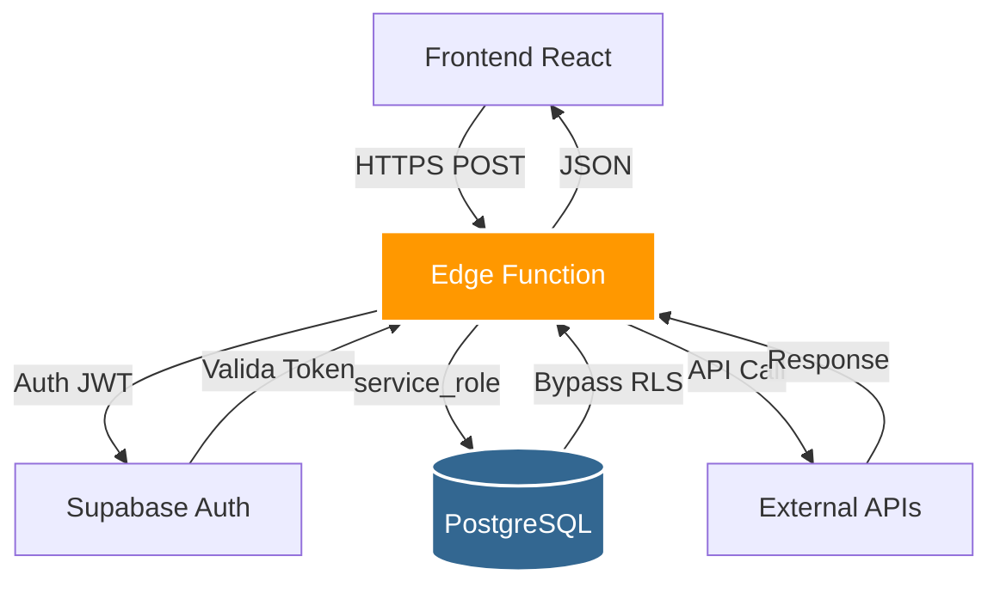

# ⚡ Edge Functions (Funções Serverless) - Ortho+

> Documentação técnica das funções serverless em Deno hospedadas no Supabase

---

## 📋 Índice

1. [O que são Edge Functions?](#o-que-são-edge-functions)
2. [Arquitetura](#arquitetura)
3. [Lista Completa de Functions](#lista-completa-de-functions)
4. [Deploy e Versionamento](#deploy-e-versionamento)
5. [Monitoramento e Logs](#monitoramento-e-logs)
6. [Troubleshooting](#troubleshooting)

---

## 🎯 O que são Edge Functions?

**Edge Functions** são funções serverless escritas em **Deno** (runtime TypeScript) que rodam na infraestrutura global do Supabase.

### Vantagens:
- ✅ **Serverless**: Zero infraestrutura para gerenciar
- ✅ **TypeScript nativo**: Type-safe por padrão
- ✅ **Global**: Execução próxima ao usuário (low latency)
- ✅ **Auto-scaling**: Escala automaticamente com demanda
- ✅ **Seguro**: Acesso direto ao banco via `service_role` key

### Quando usar Edge Functions?

Use Edge Functions para:
- 🔐 **Lógica de negócio sensível**: Cálculos que não devem rodar no frontend
- 🔗 **Integrações externas**: Chamar APIs de terceiros (SEFAZ, WhatsApp, etc)
- 📧 **Notificações**: Enviar emails/SMS via Resend, Twilio
- ⏰ **Tarefas agendadas**: Cron jobs (backups, lembretes)
- 🧮 **Processamento pesado**: Análise de IA, cálculos complexos

---

## 🏗️ Arquitetura



### Características:
- **Runtime**: Deno 1.37+ (TypeScript, Web APIs)
- **Timeout**: 60 segundos (configurável até 300s)
- **Memory**: 512 MB (configurável até 2 GB)
- **Cold Start**: < 100ms (V8 isolates)

---

## 📚 Lista Completa de Functions

### 🔐 Autenticação e Controle de Acesso

#### `get-my-modules`
**Propósito**: Busca módulos disponíveis para a clínica com estado de dependências

**Endpoint**: `POST /functions/v1/get-my-modules`

**Request**:
```typescript
// Sem body - usa clinic_id do JWT
```

**Response**:
```typescript
{
  modules: [
    {
      module_key: "FINANCEIRO",
      name: "Gestão Financeira",
      is_active: true,
      subscribed: true,
      can_activate: true,
      can_deactivate: true,
      unmet_dependencies: []
    },
    {
      module_key: "SPLIT_PAGAMENTO",
      name: "Split de Pagamento",
      is_active: false,
      subscribed: true,
      can_activate: false, // Depende de FINANCEIRO
      can_deactivate: true,
      unmet_dependencies: ["FINANCEIRO"]
    }
  ]
}
```

**Implementação**:
```typescript
// supabase/functions/get-my-modules/index.ts
import { serve } from "https://deno.land/std@0.168.0/http/server.ts"
import { createClient } from 'jsr:@supabase/supabase-js@2'

serve(async (req) => {
  const supabaseClient = createClient(
    Deno.env.get('SUPABASE_URL') ?? '',
    Deno.env.get('SUPABASE_SERVICE_ROLE_KEY') ?? ''
  )

  // Extrai clinic_id do JWT
  const authHeader = req.headers.get('Authorization')!
  const token = authHeader.replace('Bearer ', '')
  const { data: { user } } = await supabaseClient.auth.getUser(token)
  
  const { data: profile } = await supabaseClient
    .from('profiles')
    .select('clinic_id')
    .eq('id', user.id)
    .single()

  // Busca módulos com dependências
  const { data: modules } = await supabaseClient
    .from('clinic_modules')
    .select(`
      *,
      module_catalog!inner(*),
      dependencies:module_dependencies(depends_on_module_id)
    `)
    .eq('clinic_id', profile.clinic_id)

  // Lógica de can_activate/can_deactivate...
  
  return new Response(JSON.stringify({ modules }), {
    headers: { 'Content-Type': 'application/json' }
  })
})
```

---

#### `toggle-module-state`
**Propósito**: Ativa/desativa módulo com validação de dependências

**Endpoint**: `POST /functions/v1/toggle-module-state`

**Request**:
```typescript
{
  module_key: "SPLIT_PAGAMENTO"
}
```

**Response**:
```typescript
{
  success: true,
  new_state: true,
  cascaded_activations: ["FINANCEIRO"] // Módulos ativados em cascata
}
```

**Validações**:
- ✅ Usuário é ADMIN
- ✅ Módulo está contratado
- ✅ Dependências satisfeitas (se ativando)
- ✅ Nenhum módulo depende dele (se desativando)

**Código Principal**:
```typescript
// Ativação em cascata (BFS)
if (newState === true) {
  const queue = [moduleId]
  const activated = new Set()
  
  while (queue.length > 0) {
    const current = queue.shift()
    const deps = await getDependencies(current)
    
    for (const dep of deps) {
      if (!isActive(dep)) {
        await activateModule(dep)
        activated.add(dep)
        queue.push(dep)
      }
    }
  }
  
  return { cascaded_activations: Array.from(activated) }
}
```

---

### 💰 Financeiro e Pagamentos

#### `processar-pagamento-tef`
**Propósito**: Integração com TEF (maquininha de cartão)

**Endpoint**: `POST /functions/v1/processar-pagamento-tef`

**Request**:
```typescript
{
  valor: 150.00,
  tipo_cartao: "credito", // ou "debito"
  parcelas: 3,
  nsu_terminal: "123456" // Número da transação TEF
}
```

**Integração com operadoras**:
- Stone
- Cielo
- Rede
- PagSeguro

---

#### `sync-crypto-wallet`
**Propósito**: Sincronizar saldos de carteiras cripto com exchanges

**Endpoint**: `POST /functions/v1/sync-crypto-wallet`

**Request**:
```typescript
{
  wallet_address: "1A1zP1eP5QGefi2DMPTfTL5SLmv7DivfNa",
  crypto: "BTC"
}
```

**Response**:
```typescript
{
  balance: 0.0523,
  balance_brl: 15234.50,
  last_sync: "2025-01-15T10:30:00Z",
  exchange_rate: 291000.00
}
```

**APIs integradas**:
- CoinGecko (cotações)
- Binance API
- Coinbase API
- Blockchain.info (Bitcoin)

---

### 📧 Notificações e Comunicação

#### `send-email`
**Propósito**: Enviar emails transacionais via Resend

**Endpoint**: `POST /functions/v1/send-email`

**Request**:
```typescript
{
  to: "paciente@email.com",
  subject: "Confirmação de Consulta",
  template: "appointment-confirmation",
  data: {
    patient_name: "João Silva",
    appointment_date: "2025-01-20",
    appointment_time: "14:00",
    dentist_name: "Dra. Maria Santos"
  }
}
```

**Templates disponíveis**:
- `appointment-confirmation`: Confirmação de consulta
- `appointment-reminder`: Lembrete 24h antes
- `budget-approved`: Orçamento aprovado
- `lgpd-data-export`: Exportação de dados (LGPD)

---

#### `send-whatsapp`
**Propósito**: Enviar mensagens WhatsApp via Twilio

**Endpoint**: `POST /functions/v1/send-whatsapp`

**Request**:
```typescript
{
  to: "+5511987654321",
  message: "Olá João! Sua consulta está confirmada para amanhã às 14h."
}
```

**Configuração Twilio**:
```typescript
const TWILIO_ACCOUNT_SID = Deno.env.get('TWILIO_ACCOUNT_SID')
const TWILIO_AUTH_TOKEN = Deno.env.get('TWILIO_AUTH_TOKEN')
const TWILIO_WHATSAPP_FROM = Deno.env.get('TWILIO_WHATSAPP_FROM') // Ex: +14155238886

const response = await fetch(
  `https://api.twilio.com/2010-04-01/Accounts/${TWILIO_ACCOUNT_SID}/Messages.json`,
  {
    method: 'POST',
    headers: {
      'Authorization': `Basic ${btoa(`${TWILIO_ACCOUNT_SID}:${TWILIO_AUTH_TOKEN}`)}`,
      'Content-Type': 'application/x-www-form-urlencoded'
    },
    body: new URLSearchParams({
      From: `whatsapp:${TWILIO_WHATSAPP_FROM}`,
      To: `whatsapp:${to}`,
      Body: message
    })
  }
)
```

---

### 🤖 Inteligência Artificial

#### `analyze-radiografia`
**Propósito**: Análise de radiografias com Google Gemini Vision

**Endpoint**: `POST /functions/v1/analyze-radiografia`

**Request**:
```typescript
{
  image_url: "https://storage.supabase.co/radiografias/abc123.jpg",
  tipo_radiografia: "periapical"
}
```

**Response**:
```typescript
{
  problemas_detectados: 3,
  confidence_score: 0.87,
  resultado: {
    caries: [
      { dente: "16", severidade: "moderada", localizacao: "oclusal" },
      { dente: "26", severidade: "leve", localizacao: "proximal" }
    ],
    fraturas: [],
    anomalias: [
      { tipo: "reabsorção óssea", localizacao: "região periapical do 16" }
    ]
  },
  sugestoes_tratamento: [
    "Restauração do dente 16 (cárie oclusal moderada)",
    "Avaliar necessidade de tratamento endodôntico no dente 16"
  ]
}
```

**Implementação Gemini**:
```typescript
import { GoogleGenerativeAI } from "@google/generative-ai"

const genAI = new GoogleGenerativeAI(Deno.env.get('GOOGLE_API_KEY')!)
const model = genAI.getGenerativeModel({ model: "gemini-2.0-flash-exp" })

const imageData = await fetch(image_url).then(r => r.arrayBuffer())
const base64Image = btoa(String.fromCharCode(...new Uint8Array(imageData)))

const result = await model.generateContent([
  {
    inlineData: {
      mimeType: "image/jpeg",
      data: base64Image
    }
  },
  `Analise esta radiografia odontológica do tipo ${tipo_radiografia}.
   
   Identifique:
   1. Cáries (localização, severidade)
   2. Fraturas dentárias
   3. Anomalias ósseas ou periodontais
   4. Sugestões de tratamento
   
   Retorne em JSON estruturado.`
])

const analysis = JSON.parse(result.response.text())
```

---

### 📄 Fiscal e Compliance

#### `gerar-nfce`
**Propósito**: Gerar NFCe e enviar para autorização SEFAZ

**Endpoint**: `POST /functions/v1/gerar-nfce`

**Request**:
```typescript
{
  venda_id: "uuid-da-venda",
  itens: [
    { descricao: "Limpeza", quantidade: 1, valor_unitario: 150.00 }
  ],
  cpf_cliente: "12345678900",
  forma_pagamento: "cartao_credito"
}
```

**Response**:
```typescript
{
  nfce_numero: "000123",
  chave_acesso: "35250112345678000190650010001230001234567890",
  protocolo_autorizacao: "135250000012345",
  xml_url: "https://storage.supabase.co/nfce/123.xml",
  status: "autorizada"
}
```

**Integração SEFAZ**:
```typescript
// Monta XML NFCe
const xml = buildNFCeXML({
  serie: '001',
  numero: nextNumero,
  emitente: clinicData,
  destinatario: { cpf: cpf_cliente },
  itens: itens.map(i => ({
    descricao: i.descricao,
    quantidade: i.quantidade,
    valorUnitario: i.valor_unitario,
    valorTotal: i.quantidade * i.valor_unitario,
    cfop: '5102', // Venda
    ncm: '85444290' // Serviços odontológicos
  }))
})

// Assina digitalmente com certificado ICP-Brasil
const xmlAssinado = await signXML(xml, certificadoDigital)

// Envia para SEFAZ
const response = await fetch(
  `https://nfce.fazenda.sp.gov.br/ws/nfeautorizacao4.asmx`,
  {
    method: 'POST',
    headers: { 'Content-Type': 'text/xml' },
    body: buildSOAPEnvelope(xmlAssinado)
  }
)

const protocolo = parseXMLResponse(await response.text())
```

---

### ⏰ Tarefas Agendadas (Cron)

#### `processar-lembretes-consulta`
**Propósito**: Enviar lembretes 24h antes das consultas (roda diariamente às 8h)

**Configuração Cron**:
```toml
# supabase/functions/_cron/processar-lembretes-consulta
[[ cron ]]
function = "processar-lembretes-consulta"
schedule = "0 8 * * *"  # Todo dia às 8h (UTC)
```

**Lógica**:
```typescript
// Busca consultas nas próximas 24-25h
const tomorrow = new Date()
tomorrow.setDate(tomorrow.getDate() + 1)

const { data: appointments } = await supabase
  .from('appointments')
  .select('*, patients(*)')
  .gte('start_time', tomorrow.toISOString())
  .lt('start_time', new Date(tomorrow.getTime() + 3600000).toISOString())
  .eq('status', 'agendado')

for (const apt of appointments) {
  await sendWhatsApp({
    to: apt.patients.phone,
    message: `Olá ${apt.patients.full_name}! Lembrete: você tem consulta amanhã às ${formatTime(apt.start_time)}.`
  })
  
  // Registra envio
  await supabase.from('appointment_reminders').insert({
    appointment_id: apt.id,
    sent_at: new Date(),
    status: 'enviado'
  })
}
```

---

## 🚀 Deploy e Versionamento

### Deploy Manual

```bash
# Deploy de uma function específica
npx supabase functions deploy get-my-modules

# Deploy de todas as functions
npx supabase functions deploy

# Deploy com secrets
npx supabase secrets set GOOGLE_API_KEY=your_key
npx supabase functions deploy analyze-radiografia
```

### Deploy Automático (CI/CD)

**GitHub Actions** (`.github/workflows/deploy-functions.yml`):
```yaml
name: Deploy Edge Functions

on:
  push:
    branches: [main]
    paths:
      - 'supabase/functions/**'

jobs:
  deploy:
    runs-on: ubuntu-latest
    steps:
      - uses: actions/checkout@v3
      
      - name: Setup Supabase CLI
        uses: supabase/setup-cli@v1
      
      - name: Deploy Functions
        run: |
          supabase functions deploy --project-ref ${{ secrets.SUPABASE_PROJECT_REF }}
        env:
          SUPABASE_ACCESS_TOKEN: ${{ secrets.SUPABASE_ACCESS_TOKEN }}
```

### Versionamento

**Estratégia**: Semantic Versioning (SemVer)

```typescript
// Cada function tem uma versão no header
export const FUNCTION_VERSION = "1.2.3"

serve(async (req) => {
  return new Response(JSON.stringify({ version: FUNCTION_VERSION }), {
    headers: { 
      'Content-Type': 'application/json',
      'X-Function-Version': FUNCTION_VERSION
    }
  })
})
```

---

## 📊 Monitoramento e Logs

### Ver Logs em Tempo Real

```bash
# Logs de uma function específica
npx supabase functions logs get-my-modules --tail

# Logs de todas as functions
npx supabase functions logs --tail

# Filtrar por erro
npx supabase functions logs --level error
```

### Logs Estruturados

```typescript
// Sempre use console.log/error para rastreabilidade
console.log(JSON.stringify({
  level: 'info',
  function: 'get-my-modules',
  user_id: user.id,
  clinic_id: profile.clinic_id,
  action: 'fetch_modules',
  duration_ms: Date.now() - startTime
}))

console.error(JSON.stringify({
  level: 'error',
  function: 'send-email',
  error: error.message,
  stack: error.stack,
  context: { to, template }
}))
```

### Métricas Prometheus

**Endpoint**: `GET /functions/v1/metrics`

Expõe métricas:
- `edge_function_invocations_total`: Total de chamadas
- `edge_function_duration_seconds`: Latência
- `edge_function_errors_total`: Total de erros

---

## 🐛 Troubleshooting

### Erro: "Function timeout after 60s"

**Causa**: Function excedeu tempo limite

**Solução**:
```typescript
// Aumentar timeout (max 300s)
import { serve } from "https://deno.land/std@0.168.0/http/server.ts"

serve({ handler, timeoutMs: 120000 }) // 120s
```

---

### Erro: "Invalid JWT"

**Causa**: Token expirado ou inválido

**Solução**:
```typescript
// Sempre valide token antes de usar
const authHeader = req.headers.get('Authorization')
if (!authHeader) {
  return new Response('Unauthorized', { status: 401 })
}

const { data: { user }, error } = await supabase.auth.getUser(
  authHeader.replace('Bearer ', '')
)

if (error) {
  return new Response(JSON.stringify({ error: 'Invalid token' }), {
    status: 401
  })
}
```

---

### Erro: "Secret not found"

**Causa**: Secret não configurado no Supabase

**Solução**:
```bash
# Configurar secret
npx supabase secrets set GOOGLE_API_KEY=your_key

# Listar secrets
npx supabase secrets list

# Verificar no código
const apiKey = Deno.env.get('GOOGLE_API_KEY')
if (!apiKey) {
  throw new Error('GOOGLE_API_KEY not configured')
}
```

---

## 📚 Recursos

- [Supabase Edge Functions Docs](https://supabase.com/docs/guides/functions)
- [Deno Manual](https://deno.land/manual)
- [Deno Deploy](https://deno.com/deploy)

---

**Próximos Guias:**  
→ [04-AUTENTICACAO-RLS](./04-AUTENTICACAO-RLS.md) - Autenticação e Row Level Security  
→ [05-MODULOS-DEPENDENCIAS](./05-MODULOS-DEPENDENCIAS.md) - Sistema modular detalhado
